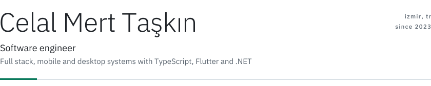
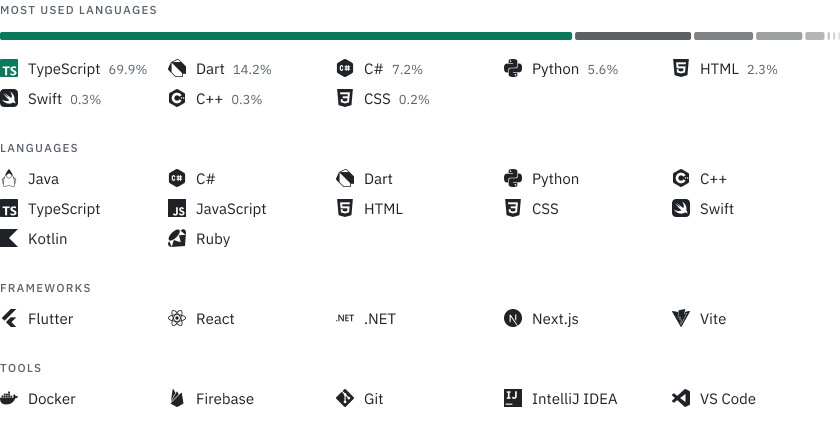
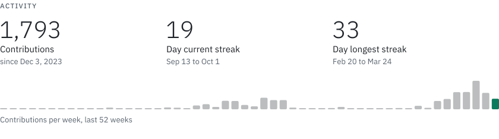
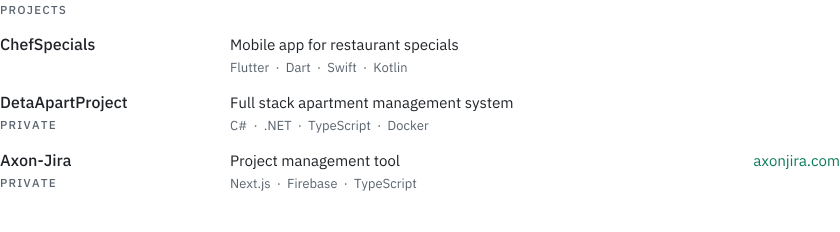

<picture>
  <source media="(prefers-color-scheme: dark)" srcset="./assets/header-dark.svg">
  
</picture>

 

<picture>
  <source media="(prefers-color-scheme: dark)" srcset="./assets/stack-dark.svg">
  
</picture>

 

<picture>
  <source media="(prefers-color-scheme: dark)" srcset="./assets/activity-dark.svg">
  
</picture>

 

<a href="https://github.com/taskincelalmert?tab=repositories">
  <picture>
    <source media="(prefers-color-scheme: dark)" srcset="./assets/projects-dark.svg">
    
  </picture>
</a>

 

<a href="https://www.linkedin.com/in/celal-mert-taskin/">
  <picture>
    <source media="(prefers-color-scheme: dark)" srcset="./assets/contact-dark.svg">
    
  </picture>
</a>
